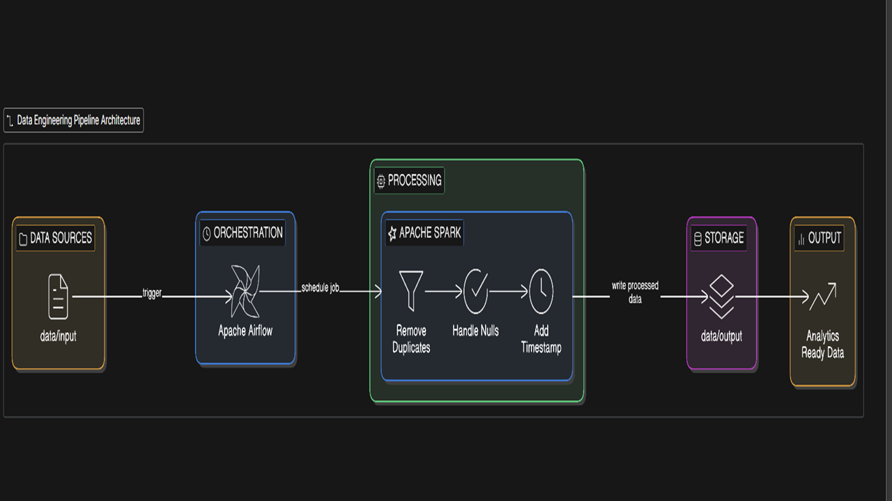

# End-to-End Data Engineering Pipeline

## Project Overview

This project implements an end-to-end data engineering pipeline that processes raw data and converts it into analytics-ready datasets. The pipeline uses Apache Spark for distributed data processing, Apache Airflow for workflow orchestration, Delta Lake for reliable storage, and Docker for environment setup.

The system automatically ingests raw datasets, performs data cleaning and transformations, and stores the processed data in Delta format.

---

## Architecture

Raw Data
↓
Input Directory
↓
Airflow DAG (Scheduler / Event Trigger)
↓
Spark Job (PySpark)
↓
Data Cleaning & Transformation
↓
Delta Lake Storage
↓
Processed Dataset for Analytics

---

## System Design (Phase 1)

### Components

- **Data source (CSV files)**: Raw files land in `data/input/` (bind-mounted into containers).
- **Orchestrator (Apache Airflow)**:
  - **Scheduled pipeline**: runs daily at 5:00 AM to process the latest input data.
  - **Event-driven pipeline**: watches the input directory and triggers processing when new files arrive.
  - **Airflow UI + logs**: provides run history, task retries, and debugging output.
- **Processing engine (Apache Spark / PySpark)**:
  - Reads input CSVs, performs cleaning/transformation, and writes results.
  - Can run in a distributed mode (Spark master/workers) inside Docker.
- **Storage layer (Delta Lake)**:
  - Output is written in **Delta format** to `data/output/` to provide **ACID transactions**, consistent reads, and scalable file-based storage.

### Data Flow

1. **Ingest**: CSV files are placed into `data/input/`.
2. **Trigger**:
   - **Daily DAG** triggers at 5:00 AM, or
   - **Event DAG** triggers when new files appear in `data/input/`.
3. **Process (Spark job)**:
   - Read CSVs (header + schema inference)
   - Remove duplicates
   - Handle missing/null values
   - Add `processing_timestamp`
4. **Persist (Delta)**: Write the curated dataset as a Delta table under `data/output/` using overwrite mode.
5. **Consume**: Analytics tools / downstream jobs read from the Delta output.

### Reliability & Idempotency

- **Idempotent writes**: The Spark job writes with **overwrite**, so reruns produce the same deterministic output for the same input snapshot.
- **Airflow retries**: transient failures are handled via task retries (configured in DAGs), with full logs available in the UI.
- **Delta Lake guarantees**: Delta provides transactional consistency and protects against partial writes.

### Scalability

- **Horizontal scaling**: Spark can scale out via worker containers to handle larger datasets.
- **Schema handling**: Schema inference is enabled for quick prototyping; schema enforcement/evolution can be added as an enhancement for production hardening.

### Observability

- **Airflow UI**: run status, retries, task logs.
- **Spark logs/UI**: job stages, performance metrics, executor details (when enabled in the Spark setup).

---

## Technology Stack

* Python
* Apache Spark (PySpark)
* Apache Airflow
* Delta Lake
* Docker

---

## Project Structure

```
data-engineering-pipeline-hackathon
│
├── dags
│   ├── daily_spark_pipeline.py
│   └── event_trigger_pipeline.py
│
├── spark_jobs
│   └── process_data.py
│
├── data
│   ├── input
│   └── output
│
├── docker
│   └── docker-compose.yml
│
├── requirements.txt
└── README.md
```

---

## Setup Instructions

### 1. Clone Repository

```
git clone https://github.com/ShreyasDamle2805/data-engineering-pipeline-hackathon.git
cd data-engineering-pipeline-hackathon
```

### 2. Start Docker Environment

```
docker compose up
```

### 3. Install Python Dependencies

```
pip install -r requirements.txt
```

---

## Running the Pipeline

1. Place the dataset inside:

```
data/input/
```

2. Open Airflow UI

```
http://localhost:8081
```

3. Enable the DAG:

* daily_spark_pipeline
* event_trigger_pipeline

4. The Spark job will run and process the data.

---

## Data Processing Steps

The Spark job performs the following transformations:

* Removes duplicate records
* Handles missing values
* Adds a processing timestamp column
* Writes processed data in Delta Lake format

---

## Output

The processed dataset is stored in:

```
data/output/processed/
```

The output follows the Delta Lake structure.

---

## Optional Enhancements

Additional improvements that can be implemented:

* Schema evolution
* Data partitioning
* Data quality validation
* Logging and monitoring
